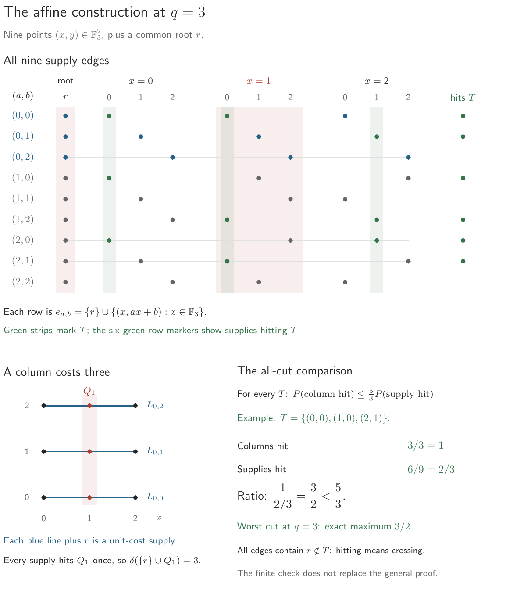

# Covering versus hitting in diversity embeddings: an affine obstruction and matching bounds

**Version 0.1.0 — local release candidate. Not yet admitted or published.**
No tag, permanent archive, or DOI exists for this release.

A diversity, introduced by Bryant and Tupper in
[*Hyperconvexity and tight-span theory for diversities*](https://doi.org/10.1016/j.aim.2012.08.008)
(2012), generalizes a metric by assigning a nonnegative value to each finite
set of points, subject to a generalized triangle inequality. An ℓ₁ diversity
measures this value by summing coordinate ranges. This paper gives a compact
hypergraph whose connected spanning costs cannot be approximated well by
any such representation.

For every prime power `q`, the construction has `q² + 1` vertices, `q²`
unit-length supply edges, and `O(q³ log q)` encoding bits. Its minimum
ℓ₁ diversity distortion satisfies

```text
q²/(2q − 1) ≤ D ≤ q.
```

The existential square-root lower bound and the finite constant already
follow from Badanidiyuru et al., *Sketching Valuation Functions*, through a
rooted realization with `q^q` supplies. The contribution examined here is the
compact affine realization and its encoding-size and connector-LP consequences.
Priority of that precise contribution remains unresolved.

Read the [paper](paper/main.pdf) or its [TeX source](paper/main.tex).

## Claim and scope

The compact encoding contradicts Conjecture 1.7 of Jozefiak and Shepherd
**as written in arXiv:2303.04199v1**. The obstruction concerns existence and
allows unrestricted finite target dimension and computation. The specified
connector LP has optimum `1/q` and integrality gap at least `q²/(2q − 1)`.
This does not establish hardness for all hypergraph sparsest-cut algorithms.

Established universal set-cover approximations give upper bounds `4√n`
for unit-cost pairwise-intersecting supplies and `2√(n H_n)` for positive
costs in that class, where `H_n` is the nth harmonic number. No common root
is required. The square-root exponent is tight even with empty global edge
intersection. These are special-class bounds: in arbitrary hypergraphs,
connected spanning cost divided by cover cost can be unbounded. The general
square-root upper bound and removal of the weighted logarithm remain
unresolved here. The weighted greedy-bad example does not itself obstruct
arbitrary coverage approximations.

## A small example



The green columns select `T = {(0,0), (1,0), (2,1)}`. It hits all three
column demands and six of nine supplies, giving ratio `3/2`. Exact enumeration
of all 512 subsets confirms that this is the maximum for `q=3`; the empty set
has zero hits on both sides and no defined ratio. There are 18 maximizers,
all non-collinear triples. The general moment certificate is `(2q−1)/q`,
which is `5/3` here. This finite check does not establish the bound for other q.

The [figure generator](scripts/draw_affine_q3.py) uses the
[exact enumeration](scripts/affine_q3.py); the complete
[512-subset record](paper/figures/affine-q3-checks.json) is included.
Run `make figures` to regenerate the figure, or `make verify` to check the
finite record without a TeX installation. See BUILD.md for dependencies.

## Context and credit

The proof compares how expensive demands are to cover with how frequently
cuts hit supplies and demands. The affine pairwise-independent sample space
is classical; the assignment bounds come from universal set cover.
[The prior-work record](audit/PRIOR_WORK.md) compares these mechanisms and
records the limits of the search. The conjecture comparison does not extend
to an unchecked journal revision.

Kline's 2019 work on the d-dimensional earth mover's problem supplies the
geometric starting point. The later prefix-width study identifies range-cost
multi-marginal earth moving with coordinate-range diversity. Both are
credited in the introduction and bibliography; the obstruction does not
depend on the later transport-rigidity theorem.

## Evidence and artifacts

The general results rest on the proofs. The figure adds an exact, exhaustive
check of the hitting ratio at q=3; this finite check does not replace those
proofs. Exploratory campaign computations are excluded from this release.
Selected P07 records preserve a sealed statement-only attack, the subsequent
proof audit, and separate exact-source checks. Their scopes and the fresh
release audits are recorded in [AUDIT_LEDGER.md](AUDIT_LEDGER.md).
Process-separated AI audits are not independent expert review or peer review.

- [BUILD.md](BUILD.md): dependencies and reproducible commands.
- [VERIFICATION.md](VERIFICATION.md): final build and visual checks.
- [ADMISSION.md](ADMISSION.md): P1, A1, and R1 gate dispositions.
- [CORRECTIONS.md](CORRECTIONS.md): correction and withdrawal policy.
- [CITATION.cff](CITATION.cff): machine-readable citation metadata.
- [MANIFEST.sha256](MANIFEST.sha256): tracked-file integrity.
- [NOTICE](NOTICE): provenance and licensing scope.

## Reproduction

With Python 3 and pdfLaTeX available, run:

```sh
make paper
make verify
```

The build checks two clean compilations for byte identity; see BUILD.md for
the pinned compiler and limits of cross-installation reproducibility.

## AI assistance and responsibility

AI systems assisted with construction, proof drafting, literature search,
auditing, and exposition under Jeff Kline's direction. AI is not an author,
referee, or source of authority. Jeff Kline takes responsibility for the work.

## Citation and status

Jeff Kline. *Covering versus hitting in diversity embeddings: an affine
obstruction and matching bounds*. Version 0.1.0, local release candidate, 2026.
There is no permanent citation yet. The proposed repository is
`jeff-kline/covering-hitting-diversities`; publication awaits authorization.
Admission under the [public research standard](https://jeff-kline.github.io/posts/research-program/index.html)
is a project release decision, not a correctness certificate or proof of novelty.

## License

Original paper, source, prose, and code: copyright 2026 Jeff Kline,
GNU General Public License version 3 only (`GPL-3.0-only`); see [LICENSE](LICENSE).
Earlier works retain their authors' rights and are cited rather than bundled.
